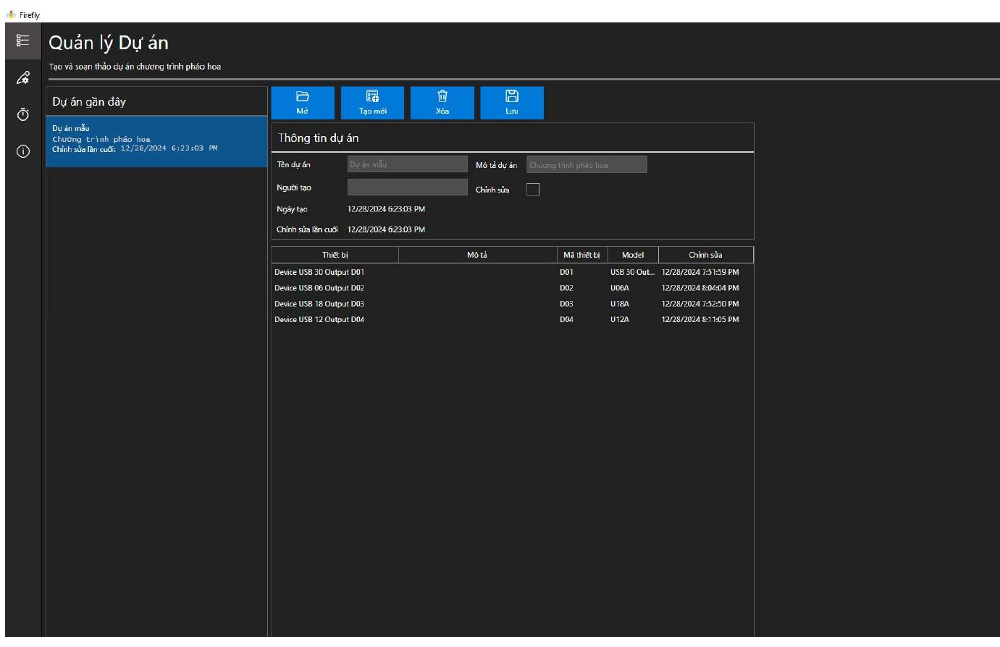

# Phần mềm Pyrosoft, Phần mềm lập trình chương trình pháo hoa

### Giới thiệu

Phần mềm Pyrosoft được sử dụng để thiết kế chương trình pháo hoa theo thời gian và kịch bản. Chương trình này được nạp tải và chạy trên các bộ điều khiển pháo hoa điện tử.

Bộ điều khiển sẽ bao gồm số lượng kênh khác nhau: 6, 12, 18, 30 kênh. Các bộ điều khiển có thể được lập trình quy cổng USB hoặc WIFI kết nối với phần mềm Pyrosoft.

Để điều khiển, các bộ điều khiển trang bộ bộ điều khiển từ xa kết RF (433MHz). Mỗi chương trình cho phép tối đa 6 kịch bản khác nhau.

Mỗi kịch bản không giới hạn số lượng bộ điều khiển cũng như kênh điều khiển. Thời gian mỗi kịch bản nằm trong khoảng từ 0 đến 36000 (x0.1s) tương đương 0 đến 1h.

### An toàn
Người sử dụng cần các biện pháp an toàn khi sử dụng bộ lập trình pháo hoa, dưới đây là các biện pháp an toàn bao gồm nhưng không giới hạn:
1) Người sử dụng phải đáp quy định của pháp luật về quản lý, sử dụng pháo hoa.
2)	Thực hiện các biện pháp an toàn theo đúng khuyến cáo của các sản phẩm pháo hoa.
3)	Khi sử dụng bộ điều khiển, tuyệt đối không đấu nối dây kích hỏa với mạch điều khiển khi mạch đang được cấp nguồn (đấu nối với nguồn).
4)	Cần ngắt mạch nguồn khi kiểm tra việc đấu nối hoặc đấu nối lại dây kích hỏa với mạch nguồn.
5)	Chỉ cấp nguồn cho bộ điều khiển khi đã bảo các điều kiện an toàn. Đảm bảo khoảng cách an toàn với nhằm ngăn ngừa dây kích trong trường hợp tự kích hoặc quá nhậy.

### Phần cứng

Bộ điều khiển pháo hoa có thể lập trình:

   - Bộ điều khiển 6, 12, 18, 30 kênh
   - Nguồn đầu vào: DC 5V - 24V
   - Tần số RF: 433Mhz
   - Độ nhạy thu: >97dbm
   - Loại điều khiển từ xa hỗ trợ: Mã học 1527Code
   - Chế độ làm việc: Tức thời
   - Dòng điện định mức trên mỗi kênh: 25A

### Giao diện chính phần mềm

Giao diện quản lý dự án

*Giao diện quản lý thiết bị*

*Giao diện quản lý kịch bản*

*Thông tin về phầm mềm, cùng đường link tài liệu hướng dẫn sử dụng*

## Hướng đẫn sử dụng phần mềm Pyrosoft

### Tạo một dự án mới

1) Chọn  tab Dự án
2) Nhấn nút tạo mới một dự an
3) Dự án mới được tạo

### Thêm thiết bị vào dự án

### Cài đặt kịch bản điều khiển qua RF

a)	Xóa mã (cài đặt lại):
Nhấn nút học liên tục trên bộ thu 5 lần, đèn sẽ nhấp nháy 3 lần và tắt. Mã đã xóa, bộ thu nghỉ.
Lưu ý rằng việc cài đặt lại có nghĩa là tất cả các điều khiển từ xa đã ghép nối của bạn sẽ cần được ghép nối lại để có thể điều khiển bộ thu một lần nữa.

b)	Thiết lập nút nhấn Scene 1 đến Scene 6:
Nhấn giữ (khoảng 3s) phím học trên Bộ thu, đèn LED trên Bộ thu sẽ nhấp nháy trên kênh cần cài đặt; Để chuyển sang kênh tiếp theo, nhấn nhả (khoảng 0.5s) phím học trên bộ thu.
Đèn tín hiệu trên kênh cần cài đặt nhấp nháy, lúc này bộ thu ở chế độ chờ ghép nối ở với Scene 1 đến Scene 6 tương ứng với LED 1 đến LED 6, hãy nhấn nút trên điều khiển từ xa (điều khiển mà bạn muốn điều khiển bộ thu), đèn LED (trên Bộ thu) sẽ sáng, cho biết quá trình học cho kênh tương ứng đã hoàn tất.
Khi bộ thu đang ở chế độ cài đặt, để chuyển về chế độ hoạt động bình thường hãy Nhấn giữ (khoảng 3s) phím học trên Bộ thu, các đèn LED trên bộ thu sẽ tắt, bộ thu đã chuyển về chế độ hoạt động bình thường.
Kiểm tra hoạt động của bộ thu và phím điều khiển đúng như kịch bản trước khi đấu nối với dây kích.

### Kiểm tra lại kịch bản và toàn bộ chương trình

1) Chọn kịch bản cần kiểm tra
2) Rà soát lại toàn bộ tham số của kịch bản: Kênh/thiết bị; Thời gian; Enable/Disable
3) In báo cáo để chuẩn bị cho việc đấu nối trên kênh tương ứng theo đúng chương trình.
